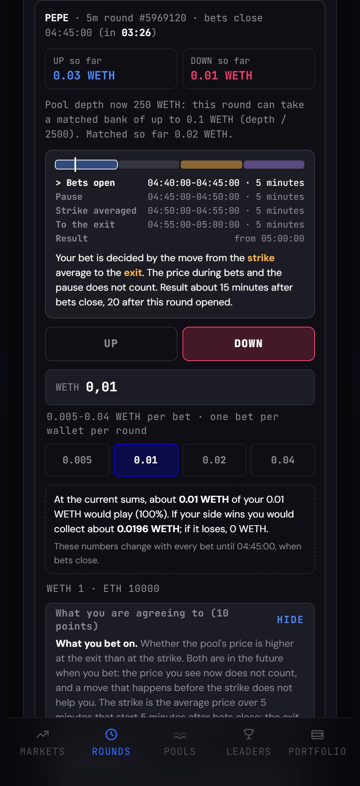
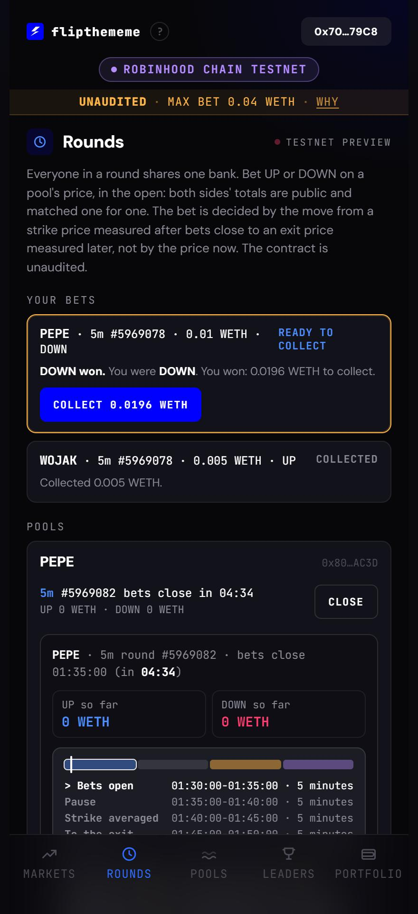
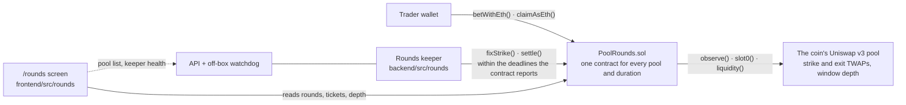

# FlipTheMeme — short UP/DOWN rounds for Robinhood Chain meme coins

[](https://github.com/Sofiia7/memepred/actions/workflows/ci.yml)

FlipTheMeme is for people who enjoy betting on outcomes but cannot find a short market for the specific meme coin they follow. They pick UP or DOWN without buying the coin. The coin's own on-chain pool supplies the price, so no listed price feed is needed. The current product is a **Robinhood Chain testnet prototype**: players stake and collect test ETH directly, while the contract uses a redeemable WETH internally.

[Try the public rounds demo](https://rhc.flipthememe.com/rounds) · [Demo video](artifacts/hackquest-demo/flipthememe-hackquest-demo.mp4) · [Verified PoolRounds contract](https://explorer.testnet.chain.robinhood.com/address/0x1e928adc9de612b08f78824417d4f5ef354c66d7) · [Keeper health](https://api-rhc.flipthememe.com/api/rounds/health) · [Buildathon application text](docs/rhc/buildathon-application.md) · [Demo recording plan](docs/rhc/ROUNDS-DEMO-RUNBOOK.md)

For this hackathon entry, use **Rounds** at the demo link above. Looking needs no wallet. Betting needs test ETH from the linked faucet; one transaction wraps and stakes it inside the contract, without a swap or token approval. Collect returns ETH. The legacy Markets tab retains its earlier, non-redeemable fixture WETH and is labeled accordingly.

<table>
  <tr>
    <td></td>
    <td></td>
  </tr>
</table>

<sub>Earlier local screenshots of the rounds interface. The current public site has a desktop layout, Robinhood Chain colors and direct ETH staking.</sub>

## One round in 30 seconds

1. Traders stake 0.005–0.04 test ETH on UP or DOWN during a five-minute betting window. The contract wraps ETH internally into a redeemable WETH and accepts equal amounts on both sides. Unmatched stake is returned without a fee; a round without enough opposing stake does not activate and refunds everyone in full.
2. After betting closes there is a five-minute pause. The strike is averaged over the next minute from the coin's v3 pool, then compared with an exit price five minutes later, so the result is due about 11 minutes after betting closes. The bet is on the move **from that future strike**, not the displayed price when the trader clicks.
3. A winner collects 1.96× the accepted stake. The contract keeps 2% of the matched bank on a win. A tie or an unpriceable active round returns matched stakes minus 1%. Players call **Collect** to receive ETH; payouts are not pushed automatically.

The pool must pass depth and price-history checks. The accepted bank is also limited by the pool's WETH depth. These checks reduce the amount exposed to price manipulation; they cannot make a thin coin safe.

## What is different here

- **The coin's own pool is both the oracle and the capacity limit.** A pool is listed only if it is the v3 factory's canonical pool for its pair, holds at least 50 WETH of depth, keeps 900 price observations and already holds the history the longest window reads. Every bet re-checks the depth, a round's bank may not exceed depth / 2,500, and anyone can delist a pool that has fallen below the gate.
- **Only matched stakes play.** Every possible payout is funded by the two sides. There is no house position, no liquidity vault and no token.
- **The strike is in the future.** Both sides get the same published price window after betting closes, so a bet placed one second before the close learns nothing the other side did not have.
- **Every failure path ends in a payout.** A lost price window, a window thinner than the bank needs, an exit window that disagrees with its own tail by more than 2%, or 24 hours without a settlement all end as a refund of the matched stakes minus 1%. Settlement is callable by anyone, collecting is never pausable, and the owner has no function that can move a player's money.

## How it fits together



The contract is the whole product on-chain: the keeper only calls two functions that anyone else may call too, and the screen reads the chain directly. If the keeper dies, a round still settles by any caller or refunds after the grace period.

## Evidence and limits

| Check | What it establishes |
|---|---|
| [Testnet end-to-end run](docs/rhc/measurements/rounds/e2e-testnet-60s.log) | On the current contract (60-second strike window, 0.01 ETH bank), 2 October: players wrap their own ETH, a winning round, a tie, a one-sided round refunded in full at the close, claims, fees and referrals: 40 checks, zero failures. The keeper fixed the strike 7-9 s after the window and settled 4-6 s after settleAt against an 839 s allowance. The winner received 0.0098 WETH for 0.005; the tie returned 0.00495. Development-script transactions, not a browser wager. |
| [Real-pool mainnet fork](docs/rhc/measurements/rounds/mainnet-fork-2026-10-01.md) | The current PoolRounds code listed the canonical RMHT/WETH pool at block 77,215,106 (about 93.5 WETH of depth against the 50 WETH gate, 1,801 observations against 900), read its real observations and paid a tie. In a second test, a locally simulated swap through that real pool moved its price; PoolRounds settled UP and paid the winner. |
| [Foundry suite](contracts/test) | Reference vectors against an independent money model, fuzzing, invariants, deadline boundaries, adversarial oracle and settlement paths from two internal review passes. New native ETH tests cover deposit, settlement payout and invalid stakes. The full suite passes on 2 October; the [30 September raw log](docs/rhc/measurements/rounds/forge-test-all.log) predates this change. The live fork test runs only when `RHC_MAINNET_RPC` is set. |

The three public testnet pools are **stand-ins with scripted prices** because the demo testnet lacks a canonical Uniswap v3 deployment. Their prices and transactions do not show organic user demand. The contract has **no external security audit**. The new ETH-in/ETH-out path passed Foundry tests and its testnet WETH passed a live deposit/withdraw check; a complete fresh-wallet browser wager and settlement on this new deployment have not yet been recorded. The mainnet fork uses real pool code and state, but its balances, stakes, price-moving swap and clock changes are local; it is not a mainnet deployment or a live wager. Price manipulation on a thin pool stays possible: the depth rule caps what it can win per round, it does not remove it. No claim of real user traction is made.

To reproduce the real-pool check from `contracts/` with Foundry installed:

```bash
RHC_MAINNET_RPC=https://robinhood-rpc.publicnode.com forge test --match-path test/PoolRoundsMainnetFork.t.sol -vv
```

This reads a live pool, so its eligibility can change. Without the environment variable the test is explicitly skipped. Use the [recorded results and blocks](docs/rhc/measurements/rounds/mainnet-fork-2026-10-01.md) when reviewing the 1 October runs.

## Where to look

The repository also carries an earlier version of the product (continuous order-book markets with an LP vault, first built for Base) and a lot of working notes. For this entry, these paths are the product:

| Path | What it is |
|---|---|
| [`contracts/src/PoolRounds.sol`](contracts/src/PoolRounds.sol), [`PoolRoundMath.sol`](contracts/src/PoolRoundMath.sol), [`PoolRoundOracle.sol`](contracts/src/PoolRoundOracle.sol) | The round contract, its money arithmetic and its pool reader. About 1,300 lines in all. |
| [`contracts/test/PoolRounds*.t.sol`](contracts/test) | Its tests: the reference vectors, fuzz and invariant suites, and the `Attack*` files written from the attacker's side. |
| [`backend/src/rounds/`](backend/src/rounds) | The keeper: deadlines read from the contract, a gas budget per round, health codes. |
| [`frontend/src/rounds/`](frontend/src/rounds) | The screen, behind the `VITE_ROUNDS_ENABLED=1` build flag. |
| [`contracts/script/DeployPoolRounds.s.sol`](contracts/script/DeployPoolRounds.s.sol), [`docs/rhc/DEPLOYMENTS.md`](docs/rhc/DEPLOYMENTS.md) | The deployment and the testnet addresses. |
| [`docs/rhc/buildathon-application.md`](docs/rhc/buildathon-application.md) | The submission text, in English. |

Most of the other notes under `docs/rhc/` are internal working documents in Russian: decision log, economics, the two internal review passes of the contract and their follow-ups. The [folder index](docs/rhc/README.md) lists them.

## Run it yourself

```bash
git clone --recurse-submodules -b robinhood-chain https://github.com/Sofiia7/memepred
cd memepred

# Contracts (Foundry 1.7.1, solc 0.8.24). npm install fetches the RedStone consumer
# contracts the older markets use; forge needs them to compile the whole tree.
cd contracts && npm install && forge test && cd ..

# Backend, frontend and workers (Node 20, pnpm 9)
pnpm install --frozen-lockfile
pnpm test

# A Robinhood Chain testnet build of the site with the rounds screen on:
# copy frontend/.env.rhc-testnet.example to frontend/.env.rhc-testnet, fill in the
# addresses from docs/rhc/DEPLOYMENTS.md, then
cd frontend && pnpm exec vite build --mode rhc-testnet
```

## Team and status

Sofia, solo founder: product and engineering, with AI-assisted development and review. The branch holds about 240 commits since July 2026. The [Robinhood Chain project notes](docs/rhc/README.md) explain the architecture, the measurements and what remains before anything touches real funds.
